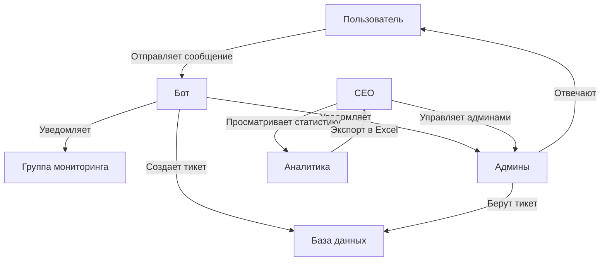
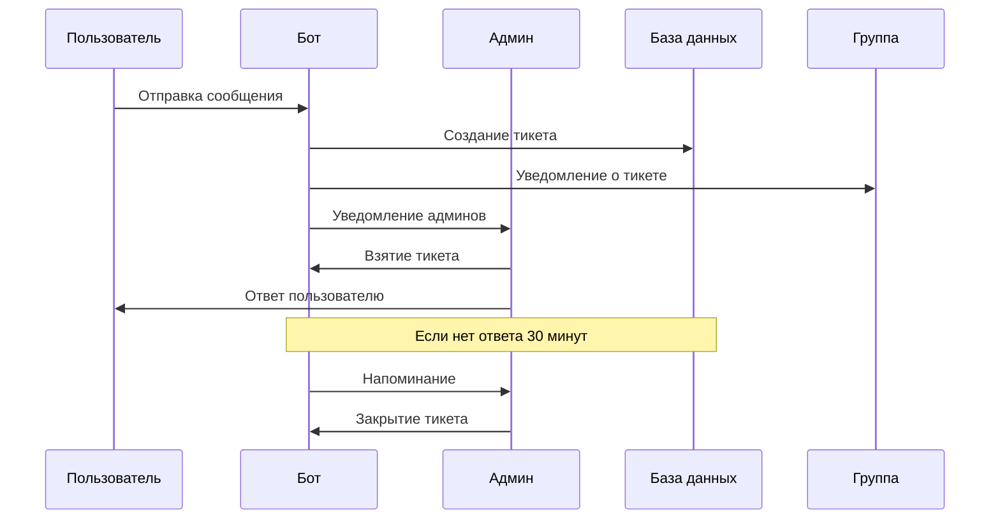
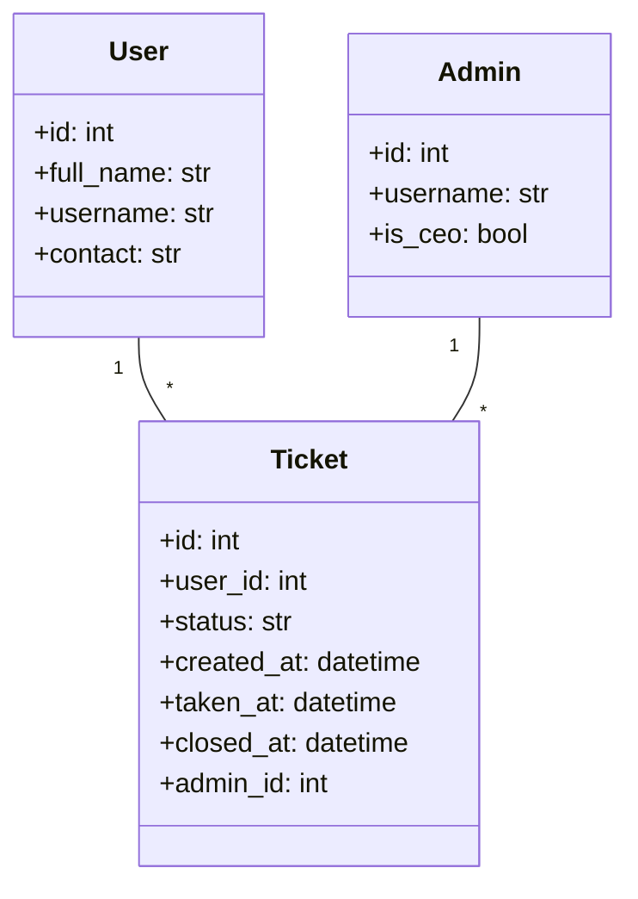

# Telegram Бот Технической Поддержки Банка

Бот для обработки обращений клиентов с системой тикетов, админ-панелью и аналитикой.

## Общая схема работы



## Процесс обработки обращения



## Структура данных



## Установка и настройка

1. Клонируйте репозиторий
2. Установите зависимости:
```bash
pip install -r requirements.txt
```
3. Создайте файл `.env` с настройками:
```env
BOT_TOKEN=ваш_токен_бота
PRIVATE_GROUP_ID=айди_группы_мониторинга
```

## Основные команды

### Пользователи
- `/start` - Начало работы с ботом
- Отправка любого сообщения создает новый тикет

### Админы
- `/admin` - Открыть админ-панель
- Кнопки в админ-панели:
  - 📋 Открытые тикеты
  - 📊 Аналитика
  - 👥 Управление админами (только для CEO)

### Команды в группе мониторинга
- `/stats` - Общая статистика
- `/my_stats` - Личная статистика админа
- `/admin_stats` - Статистика по всем админам
- `/export_day` - Экспорт за день
- `/export_week` - Экспорт за неделю
- `/export_month` - Экспорт за месяц

## Особенности

- **Роли**: Пользователь, Админ, CEO
- **Тикеты**: Создание, взятие в работу, ответ, закрытие
- **Уведомления**: 
  - Новые тикеты
  - Напоминания о пропущенных ответах (30 минут)
  - Уведомления в группу мониторинга
- **Аналитика**:
  - Статистика по тикетам
  - Время ответа и решения
  - Экспорт в Excel (день/неделя/месяц)
- **Безопасность**:
  - Проверка ролей
  - Защита от создания тикетов в группах
  - Конфиденциальность админов

## Технологии

- Python 3.9+
- Aiogram 3.13.1
- SQLite (aiosqlite)
- Pandas + XlsxWriter для отчетов
- APScheduler для напоминаний